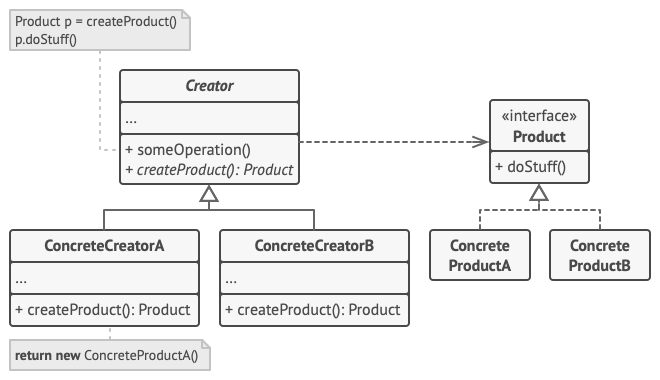

# Factory Method

### O que é?

É um padrão criacional que fornece uma interface para criação de objetos em uma superclasse, permitindo às subclasses alterarem o tipo de objetos que serão criados.

### Problema

Imagine o seguinte cenário: você está desenvolvendo uma aplicação e, inicialmente, pensando somente em uma subclasse específica. Ao longo do tempo, surge a necessidade de adicionar novas subclasses à sua aplicação. Porém, a maioria do seu código foi desenvolvido direcionado àquela primeira subclasse e acoplado à esta. Para adicionar essas novas subclasses, seriam necessárias alterações na base de todo o código, o que tornaria o código sujo e provavelmente confuso.
Em termos práticos: você está desenvolvendo uma aplicação para gestão de logística, inicialmente direcionada somente ao transporte por caminhões. Porém, com o passar do tempo, você precisa considerar também o transporte marítmo. Como a maior parte do funcionamento do código foi desenvolvido dentro da subclasse *caminhão*, desenvolver outra subclasse faria uma grande bagunça no código.

### Solução

O *factory method* é criado justamente para resolver esse problema. Ele permite que você execute chamadas para um método *fábrica*, substituindo as chamadas diretas de construção de objetos com o operador *new*. Os objetos ainda são criados com o operador *new*, mas esse agora é chamado dentro do método *fábrica*. Esses objetos retornados pelo método *fábrica* são chamados de **produtos**. Agora, podemos sobrescrever o método *fábrica* nas subclasses e alterar a classe de produtos criados pelo método. 
As subclasses só podem retornar tipos diferentes de produtos se estas possuírem uma classe ou interface básica em comum. Reutilizando o exemplo anterior, ambas as classes *caminhão* e *navio* implementam a interface *transporte* que, por sua vez, declara um método *entregar*. Porém, cada classe implementa esse método à sua maneira: os objetos da subclasse *caminhão* realizam a entrega por terra e em caixas, enquanto os objetos da subclasse *navio* fazem suas entregas por mar e em contêiners. O método *fábrica* na classe *LogisticaRodoviaria* retorna objetos *caminhão*, enquanto o mesmo método na classe *LogisticaMaritima* retorna objetos *navio*.
O código que utiliza o método *fábrica* é chamado de **código cliente**. Este não vê diferença entre os produtos retornados por diferentes subclasses. Seguindo o exemplo, o código cliente trata todos os produtos como um *Transporte* abstrato. Sabe que todos os objetos de transporte devem ter o método *entregar*, mas não o interessa de que forma isso é executado.

### Estrutura

1. **Produto →** declara a interface, comum a todos os objetos produzidos pelo criador e suas subclasses
2. **Produtos concretos →** diferentes implementações da interface de um produto
3. **Criador →** classe que declara o método *fábrica* que retorna novos objetos *produto*, que devem corresponder à interface do *produto*. O método *fábrica* pode ser declarado como abstrato, de forma que todas as subclasses sejam forçadas a implementar suas próprias versões do método. Como alternativa à não implementação de uma versão própria, o método *fábrica* base pode retornar um produto padrão predefinido. 
Importante frisar que criar produtos não é a principal responsabilidade do criador — ironicamente. Normalmente, à esta classe já está atribuída alguma lógica relacionadas aos produtos, e se diferencia das classes concretas de produtos a partir do método *fábrica*.
4. **Criadores concretos →** sobrescrevem o método *fábrica* base para retornar um tipo diferente de produto dentro da subclasse

### Aplicabilidade: **quando utilizar?**

- quando não souber de antemão os tipos e depêndencias exatas dos objetos → separa o código de produção do produto do código que realmente usa o produto → mais fácil estender somente o código de construção
- quando quiser possibilitar aos usuários do seu framework uma forma de estender seus componentes internos
- quando quiser economizar recursos do sistema reutilizando objetos em vez de recriando-os

### Pontos de destaque e pontos de melhoria
**Pontos de destaque:** 

- Baixo acoplamento
- Facilita a criação de novos tipos de produtos e a manutenção da aplicação
- Reaproveitamento de lógica

**Pontos de melhoria:**

- Maior complexidade inicial → desnecessário em casos simples
- Excesso de subclasses

---

# Prototype

### O que é?

É um padrão de projeto criacional que permite a cópia de objetos existentes sem que o código fique dependente de suas classes. Ele facilita a criação de novos objetos a partir de protótipos, evitando a necessidade de instanciar classes diretamente.

### Problema

Imagine que você tenha um objeto e precise criar uma cópia exata dele. A abordagem tradicional exigiria que você criasse um novo objeto da mesma classe e copiasse manualmente todos os campos do objeto original. No entanto, essa abordagem pode ser problemática, pois alguns campos podem ser privados e não acessíveis fora do objeto.

Além disso, essa técnica gera uma dependência do código em relação à classe do objeto, o que pode complicar a manutenção e a extensibilidade do sistema. Se você estivesse lidando com um objeto que segue uma interface, mas não conhece sua classe concreta, a cópia se tornaria um desafio.

### Solução

O padrão Prototype resolve esse problema delegando o processo de clonagem ao próprio objeto que está sendo clonado. Ele define uma interface comum para todos os objetos que suportam clonagem, permitindo que você clone um objeto sem acoplar seu código à classe específica. Essa interface geralmente contém um único método: *clonar*.

A implementação do método *clonar* é semelhante em todas as classes, criando um novo objeto da classe atual e copiando os valores dos campos do objeto original. Isso permite até mesmo a cópia de campos privados, já que a maioria das linguagens de programação permite que objetos da mesma classe acessem esses campos.

### Estrutura

1. **Cliente →** o cliente utiliza a funcionalidade de clonar objetos
2. **Protótipo →** a interface que define o método *clone* para criar cópias de instâncias
3. **Protótipo concreto →** representa uma implementação específica do protótipo, contendo atributos e a lógica da clonagem
4. **Subclasse protótipo →** uma extensão do protótipo concreto que pode adicionar mais comportamentos ou atributos

### Aplicabilidade: **quando utilizar?**

- quando seu código não depende de classes concretas de objetos que você precisa copiar
- quando você deseja reduzir o número de subclasses que se diferem apenas na forma como inicializam seus objetos
- quando você precisa de uma maneira eficiente de criar objetos complexos a partir de protótipos pré-construídos

### Pontos de destaque e pontos de melhoria
**Pontos de Destaque:**

- Permite a clonagem de objetos sem acoplamento às suas classes concretas.
- Facilita a reutilização de objetos complexos.

**Pontos de Melhoria:**

- Clonar objetos complexos com referências circulares pode ser desafiador.
- A inicialização de objetos clonados pode ser complicada.
